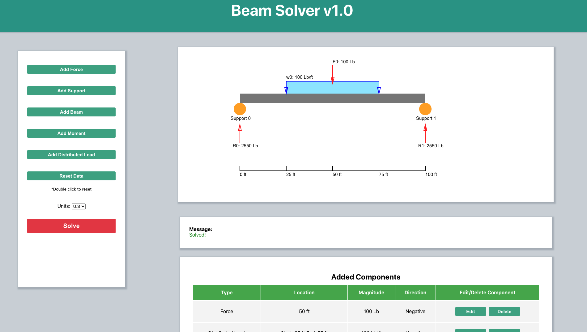

## Beam Solver v1.0

Deployed Link: http://ec2-52-53-187-29.us-west-1.compute.amazonaws.com:3000/

Beam Solver is a structural calculator for solving simply supported beams. The current version of Beam Solver is only capable of solving statically determinate structures, meaning a single beam with only two supports. However there's no limit on the number of external loads acting on the structure. To solve structures with more than two unknowns, we will need more equations. For now, let's just keep things determinatistic :)
